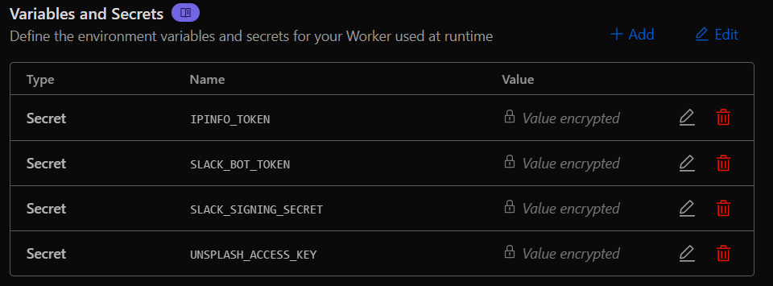

# Advanced Slack Bot
This is an advanced bot made for slack. I spent hours on researching how to make a slack bot cuz idk how to do and this is the first time. Also I ended up making it for **Cloudflare workers**, pretty cool right? No need of using [nest](nest.hackclub.com) or other services :) 

Made for [#thunder ysws](https://hackclub.slack.com/archives/C06V2GEV3MY) :)

**Check out `tutorial.md` for the brief tutorial on how to create a slack bot on your own :)**


## Features

- `/qotd` - get a random quote
- `/dt-search` - search stuff on the web
- `/userinfo` - stalk your friends (jk its just basic info)
- `/dt-poll` - make polls (for when you can't decide what to eat)
- `/dt-remind` - set reminders (so you don't forget stuff) (this pretty much dosen't work as of now)
- `/trivia` - random trivia
- `/dadjoke` - cringe dad jokes
- `/urban` - look up slang
- `/disify` - check if an email is fake
- `/dns` - look up domain dns
- `/website` - get website info
- `/weather` - check the weather
- `/song` - search for songs (pretty much useless)
- `/ip` - look up ip addresses
- `/axolotl` - random axolotl pics (they're so cute omg)
- `/catfact` - random cat facts
- `/dogfact` - random dog facts
- `/errorid` - http cats (for when things go wrong)
- `/beat` - convert between .beat time and regular time. Inspired by [this repo](https://github.com/DaInfLoop/beat-time-slack).

## Setup

If you want to make your own bot from scratch use the `base.js` to make your bot :) and **check out `tutorial.md`**
1. Clone this repo/copy paste the code into cloudflare workers
2. Copy `sample.env` to `.env` and fill in your stuff:
   ```
   SLACK_BOT_TOKEN=your-token-here
   SLACK_SIGNING_SECRET=your-secret-here
   IPINFO_TOKEN=your-ipinfo-token
   UNSPLASH_ACCESS_KEY=your-unsplash-key
   ```
3. Then add/upload .env file in the settings like this:
   
4. Add the bot to slack workspace
5. Edit the app_manifest.yaml and add that to your slash commands in the bot page (this is for the /commands import)
6. Now try using the bot by running `/help`
7. Make sure you change things like the channel id,etc.

## How to use the bot in slack

Just type `/help` in slack and it'll show you all the commands.

## Example Commands

```
/dt-search how to code
/userinfo @someone
/weather ohio
/beat @500
```

## Notes

- Made with cloudflare workers
- Uses a bunch of free apis (ofc cuz i'm broke)
- No database needed (less stuff to worry about)

## Bugs

If you find any bugs, just fix it and make a pr for me :)
or just contact [me@sdheeraj.is-cool.dev](mailto:me@sdheeraj.is-cool.dev)

---

Made with too much coffee ☕

Note - can someone from the [hc](https://hackclub.com) reimburse me for the coffee :)